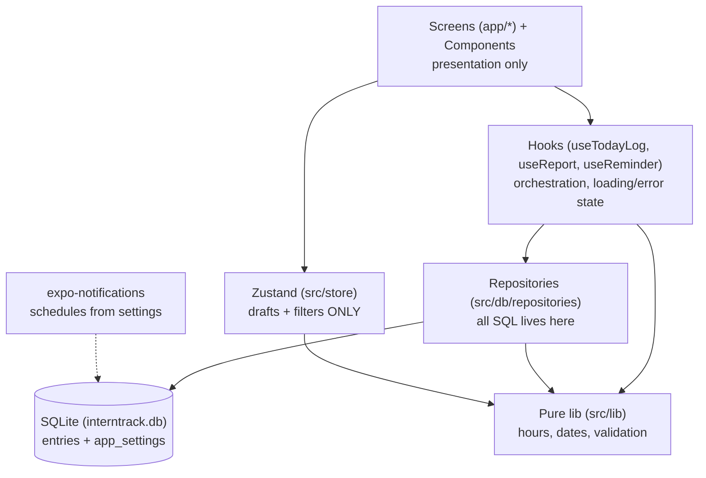
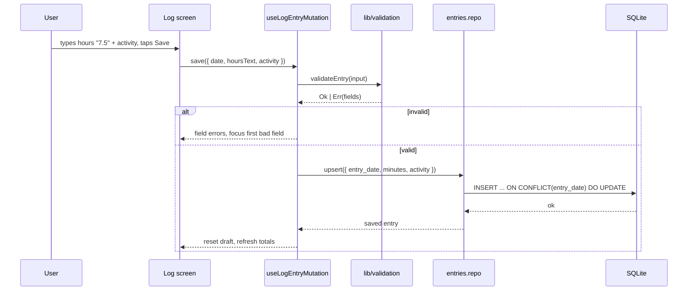

# InternTrack — Architecture

Index: [[InternTrack Index]] · Scope: [[InternTrack Overview]] · Stack: [[InternTrack Tech Stack]] · Rules: [[InternTrack Rules]] · Work: [[InternTrack Agent Tasks]]

## Design principles

1. **SQLite is the single source of truth.** Not the store, not a cache — the truth. UI reads from it, writes to it, re-reads. No in-memory copy that can drift.
2. **No network layer.** There is no API client, no fetch wrapper, no retry logic, no offline queue. If code needs it, the design is wrong. (Revisit trigger: a second device, or a supervisor account.)
3. **Exact arithmetic.** Hours live as integer minutes. Totals are `SUM(minutes)` — never JS float addition.
4. **Pure domain logic.** Hours/date maths are dependency-free functions in `src/lib`. They are testable without a renderer or a database.
5. **Thin screens.** Route files compose UI and call hooks. They contain no SQL and no business rules.
6. **Migrations, never destructive changes.** Schema changes are forward-only, versioned by `PRAGMA user_version`.

## Layer diagram



**Rule of thumb:** SQL stops at the repository boundary. Validation stops at `src/lib`. If a screen contains either, that's a bug.

## Folder structure

```
interntrack/                     # the app lives in a subfolder of the repo
├─ src/
│  ├─ app/                       # expo-router — file-based routes (TEMPLATE-DEFAULT LOCATION)
│  │  ├─ _layout.tsx             #   providers: SQLiteProvider, SafeArea, theme
│  │  ├─ index.tsx               #   Today
│  │  ├─ history.tsx             #   History
│  │  ├─ reports.tsx             #   Reports
│  │  ├─ settings.tsx            #   Settings
│  │  └─ log/
│  │     └─ [date].tsx           #   add/edit one day  (e.g. /log/2026-09-27)
│  ├─ components/                # presentational, reusable
│  │  ├─ themed-text.tsx         #   from template — KEEP, don't fork
│  │  ├─ themed-view.tsx         #   from template — KEEP
│  │  ├─ HourInput.tsx           #   numeric entry, decimal hours
│  │  ├─ ActivityInput.tsx       #   multiline text
│  │  ├─ ProgressBar.tsx
│  │  ├─ DayRow.tsx
│  │  ├─ TotalTile.tsx
│  │  └─ EmptyState.tsx
│  ├─ constants/
│  │  └─ theme.ts                # from template — design tokens live HERE
│  ├─ db/
│  │  ├─ client.ts               # openDatabaseAsync + PRAGMAs + migrate
│  │  ├─ migrations.ts           # versioned, ordered migration list
│  │  ├─ testing/                # node:sqlite test double — see T-14
│  │  └─ repositories/
│  │     ├─ entries.repo.ts
│  │     └─ settings.repo.ts
│  ├─ hooks/
│  │  ├─ use-theme.ts            # from template — KEEP
│  │  ├─ use-color-scheme.ts(.web.ts)  # from template — KEEP
│  │  ├─ useEntryForDate.ts
│  │  ├─ useLogEntryMutation.ts  # save / delete, invalidates
│  │  ├─ useReportTotals.ts
│  │  ├─ useSettings.ts
│  │  └─ useDailyReminder.ts
│  ├─ lib/                       # PURE — no React, no expo imports
│  │  ├─ hours.ts                #   toMinutes, splitMinutes, formatDuration, clampToDay
│  │  ├─ dates.ts                #   parse/today, addDays, weekRange, monthRange, formatting
│  │  └─ validation.ts           #   validateEntry -> Result<ValidEntry, FieldErrors>
│  ├─ notifications/
│  │  └─ scheduler.ts            # schedule / cancel the daily reminder
│  ├─ store/
│  │  └─ uiStore.ts              # draft form state, history filters
│  ├─ types/
│  │  └─ global.d.ts             # declares *.css (TS6 needs it for global.css)
│  └─ global.css                 # from template — web styling only
│
├─ assets/                       # icons, splash
├─ app.json  eas.json  package.json  tsconfig.json  eslint.config.js
└─ *.test.ts                     # co-located next to the file it tests
```

## Data model

### `entries` — one row per calendar day

```sql
CREATE TABLE IF NOT EXISTS entries (
  id          INTEGER PRIMARY KEY AUTOINCREMENT,
  entry_date  TEXT    NOT NULL UNIQUE,        -- 'YYYY-MM-DD', device-local
  minutes     INTEGER NOT NULL CHECK (minutes BETWEEN 1 AND 1440),
  activity    TEXT    NOT NULL CHECK (length(trim(activity)) > 0),
  created_at  INTEGER NOT NULL,               -- epoch ms
  updated_at  INTEGER NOT NULL,               -- epoch ms
  -- R-4: reject anything that is not a bare YYYY-MM-DD string. GLOB is
  -- case-sensitive, so this cannot be bypassed.
  CHECK (entry_date GLOB '[0-9][0-9][0-9][0-9]-[0-9][0-9]-[0-9][0-9]')
);

CREATE INDEX IF NOT EXISTS idx_entries_date ON entries (entry_date DESC);
```

Design notes:

- **`UNIQUE(entry_date)`** enforces the one-row-per-day rule at the database level, not in UI code. Saving an existing day = `INSERT ... ON CONFLICT(entry_date) DO UPDATE`. See [[InternTrack Rules]].
- **`CHECK` constraints carry the validation rules too** (added in `T-14`, not in the original draft). The same philosophy as `UNIQUE`: rules that protect the log belong in the database, where nothing can skip them. Every one is tested against a real SQLite engine — see [[InternTrack Agent Tasks]].
- **`minutes INTEGER`** is the whole reason totals are exact. `SUM(minutes)` in SQL, then `formatDuration()` at the edge. Rule R-1.
- **`entry_date` as `TEXT 'YYYY-MM-DD'`** sorts correctly with a plain `ORDER BY`, is timezone-free, and is trivially readable when debugging. Do not store epoch ms for the day.
- **`created_at`/`updated_at` as epoch ms** — machine-sortable, timezone-correct. Format only for display.

### `app_settings` — programme configuration

```sql
CREATE TABLE IF NOT EXISTS app_settings (
  key        TEXT PRIMARY KEY,
  value      TEXT NOT NULL,
  updated_at INTEGER NOT NULL
);
```

| Key | Type | Default | Meaning |
| --- | --- | --- | --- |
| `programStartDate` | `YYYY-MM-DD` | today | First day of the OJT period |
| `requiredMinutes` | integer | `0` | Total hours required (`0` = not set) |
| `dailyTargetMinutes` | integer | `480` | Expected hours per day (8 h) |
| `reminderEnabled` | `'true'\|'false'` | `'false'` | Daily reminder on/off |
| `reminderTime` | `HH:mm` | `18:00` | When the reminder fires |
| `internName` | text | `''` | Printed on reports (Phase 7) |

> [!important] Defaults are applied at **read** time, not written by the migration
> Migration 1 creates `app_settings` **empty**. The repository returns the default
> above when a key is absent. This is forced by `programStartDate`, whose default
> is the device's *today* — a migration runs on the database, not on the device's
> calendar, so it cannot know the value. Keeping all defaults in one place in the
> repository is more consistent than a migration that seeds some of them.

Settings live in SQLite rather than AsyncStorage so reports can read them in the same query as entries and the app has exactly one persistence mechanism.

## Data flow — saving a day



`INSERT ... ON CONFLICT(entry_date) DO UPDATE` is the whole "add or edit" story. One statement, no read-modify-write race, no branching in the UI.

## Reporting queries

All aggregation lives in SQL. Never fetch rows and reduce in JS.

```sql
-- day
SELECT * FROM entries WHERE entry_date = ?;

-- week / month / all-time (pass ISO bounds, inclusive)
SELECT COALESCE(SUM(minutes), 0) AS total FROM entries
 WHERE entry_date BETWEEN ? AND ?;

-- progress vs required
SELECT COALESCE(SUM(minutes), 0) AS done,
       (SELECT CAST(value AS INTEGER) FROM app_settings WHERE key = 'requiredMinutes') AS required
  FROM entries;

-- history, newest first
SELECT * FROM entries ORDER BY entry_date DESC LIMIT ? OFFSET ?;
```

`COALESCE(..., 0)` matters: an empty range must total `0`, not `null`.

## State management

| State | Home | Rule |
| --- | --- | --- |
| Entries, settings, totals | SQLite | Truth. Read via repository → hook → component. |
| In-progress form draft | Zustand | Survives tab switches and accidental backgrounding mid-entry. Cleared on successful save. |
| History filters / selected report range | Zustand | Pure UI. |
| Anything derived from entries | A `useMemo` over the query result, or SQL | Never duplicated into a store. |

**No `useEffect`-fetched copy of the database in global state.** That is the classic local-first bug: two sources of truth, silent drift after a write. A mutation invalidates its hook; the hook re-queries SQLite.

## Migrations

Versioning lives in `PRAGMA user_version` (0, 1, 2, …). One ordered array in `src/db/migrations.ts`:

```ts
export const MIGRATIONS: Migration[] = [
  { version: 1, up: `CREATE TABLE entries (...); CREATE TABLE app_settings (...);` },
  // { version: 2, up: `ALTER TABLE entries ADD COLUMN ...` },
];
```

On boot: read `user_version`, run every migration with a higher version, each in a transaction, then set the version.

- **Forward-only.** Never edit a shipped migration — add a new one.
- **Never `DROP TABLE`.** The user's log is the entire point of the app.
- `PRAGMA journal_mode = WAL` and `PRAGMA foreign_keys = ON` on open, and *outside* any transaction — `journal_mode` cannot be changed inside one.
- The `user_version` bump happens **inside the same transaction** as the migration body, so an interrupted upgrade leaves the database at its previous version rather than half-migrated.
- `assertMigrationsValid()` runs before anything is applied: versions must be positive integers, contiguous from 1 and strictly ascending. A gap or a duplicate would silently skip or re-run a schema change on a user's real data, so it is a hard startup error instead.
- `withExclusiveTransactionAsync`, not `withTransactionAsync`. The plain variant is **not** exclusive — any other async query open at the time gets pulled into the transaction. Migrations should never admit a bystander. Trade-off: unsupported on web, which is not a target platform here.

## Reminder flow

1. `useDailyReminder` reads `reminderEnabled` + `reminderTime` from settings.
2. On change (or first run), cancel any existing scheduled notification, then schedule a new daily one at `reminderTime` (local trigger).
3. Store the returned notification id in `app_settings` (`reminderId`) so it can be cancelled deterministically.
4. Create the Android notification channel once at startup — a daily trigger silently no-ops without it.
5. The reminder is a nudge only. It must never gate, block, or modify data.

## Navigation

expo-router, file-based. No separate navigation config. Routes live in **`src/app/`** (the template's location — see the folder structure above).

| File | Path | Notes |
| --- | --- | --- |
| `src/app/_layout.tsx` | — | `SQLiteProvider` (runs migrations) → `SafeAreaProvider` → `Stack` |
| `src/app/index.tsx` | `/` | Today. The 30-second flow. |
| `src/app/log/[date].tsx` | `/log/2026-09-27` | Add/edit one day. `date` is a validated param. |
| `src/app/history.tsx` | `/history` | Grouped list. |
| `src/app/reports.tsx` | `/reports` | Totals + progress. |
| `src/app/settings.tsx` | `/settings` | Configuration + data management. |

Tabs (`(tabs)` group) are an option for later if the screen count grows; a plain stack is simpler for 5 screens.

## Error handling

| Situation | Behaviour |
| --- | --- |
| Validation failure | Inline field errors. Never a blocking alert. |
| DB write fails | Alert with the reason; keep the draft in the store so nothing typed is lost. |
| DB fails to open / migrate | Full-screen error with a "reset app data" escape hatch. Never a white screen. |
| Corrupt `entry_date` in DB | Repository sorts it last and is skipped by range queries; never crashes the list. |
| Notification permission denied | Reminder silently disabled, surfaced once in Settings. Core logging is unaffected. |

## Testing strategy

| Layer | What to test | How |
| --- | --- | --- |
| `src/lib/*` | Hours conversion/rounding, week & month boundaries, month-end, leap years, validation cases | Jest, pure functions, no mocks. **Highest value.** |
| `src/db/*` | Migration v0→v1, idempotency, rollback, and the DDL's own `CHECK`/`UNIQUE` constraints | Jest against a `node:sqlite`-backed test double — **not** `jest-expo`'s own SQLite, see below |
| Repositories | Upsert-by-date, totals, range queries | Same test double, once `T-15`+ exist |
| Hooks | Mutation → refetch, error propagation | `@testing-library/react-native` |
| Screens | Happy path for log/save, delete confirmation | Light. Manual QA on a device does the rest. |

> [!warning] `jest-expo` cannot give you a working SQLite
> This note previously claimed repository tests ran "against an in-memory SQLite" via `jest-expo`. **They do not.** `jest-expo` replaces `expo-modules-core` with a web polyfill, so `openDatabaseAsync` throws `NativeDatabase is not a constructor`. The mock it probes for, `@expo/mocks`, **is not published** to npm.
>
> The fix, built in `T-14`, is `src/db/testing/nodeSqliteTestDouble.ts`: a ~90-line `SQLiteDatabase` stand-in on Node 24's built-in `node:sqlite`. Real SQL, real transactions, real constraints — so a typo in a `CHECK` clause is caught in seconds instead of on a user's phone at the first EAS build.
>
> It is **not** `expo-sqlite` and cannot catch a difference in how expo-sqlite binds parameters or drives transactions. `execAsync`, `getFirstAsync` and `withExclusiveTransactionAsync` are the entire surface the migration layer uses, and all three are verified in the SDK 57 API. The one genuinely untestable function is `openInternTrackDatabase()`, which calls the native opener; it is covered by `T-61`.
>
> Node's `node:sqlite` types are hand-declared in `src/db/testing/nodeSqlite.d.ts` rather than pulling in `@types/node`, which would put `setTimeout: () => NodeJS.Timeout` into the type environment of React Native app code.

Do not test `lib/` through the UI. If a test needs a renderer to check date maths, the function is in the wrong place.

## Related

- [[InternTrack Index]] · [[InternTrack Overview]] · [[InternTrack Tech Stack]] · [[InternTrack Rules]] · [[InternTrack Agent Tasks]]
